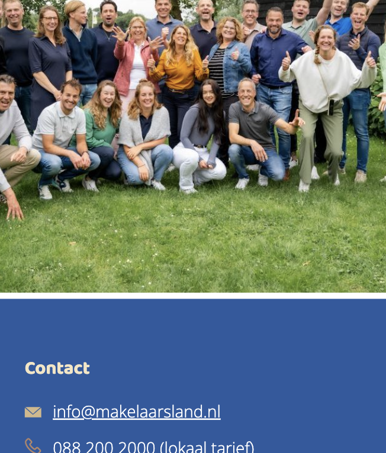
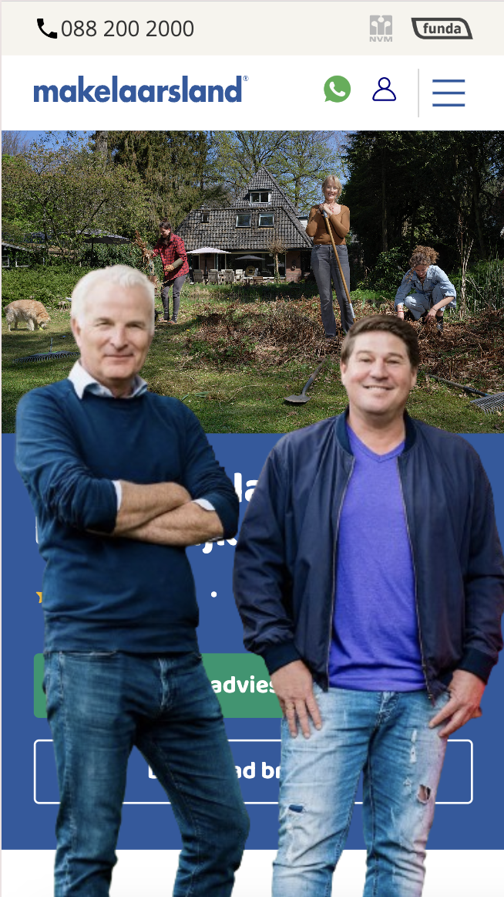
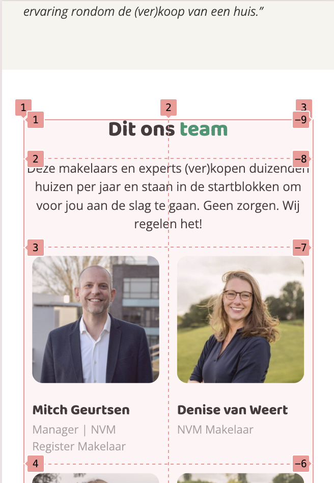
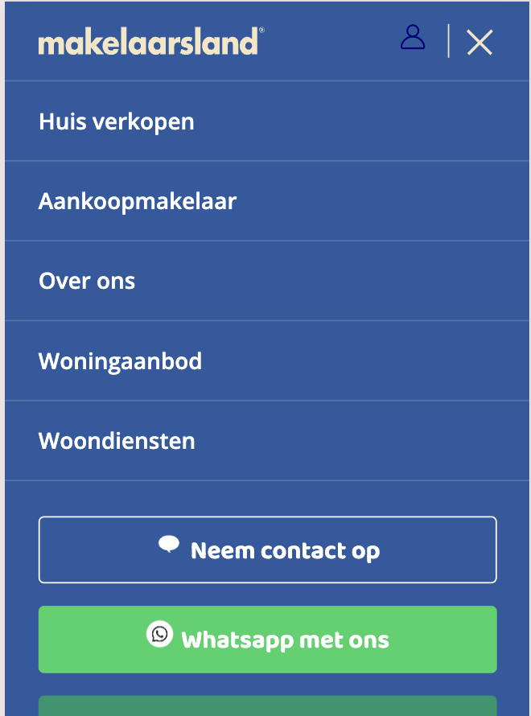
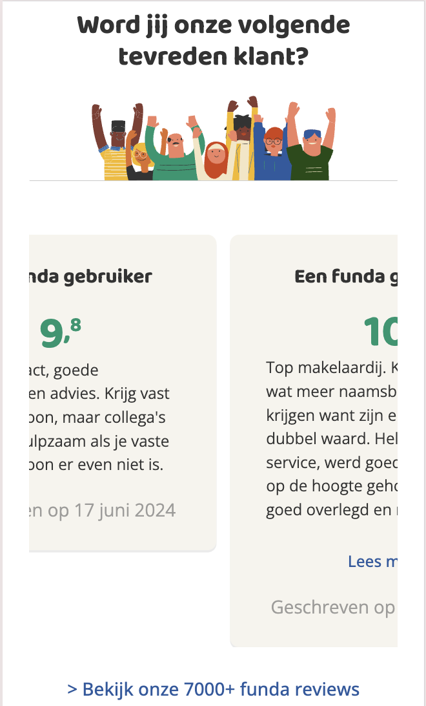
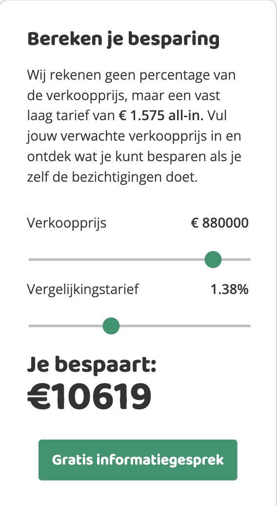
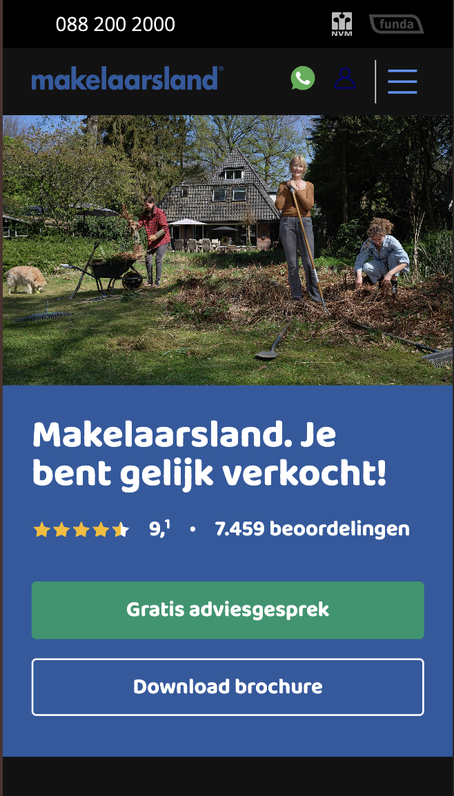

# Procesverslag
Markdown is een simpele manier om HTML te schrijven.  
Markdown cheat cheet: [Hulp bij het schrijven van Markdown](https://github.com/adam-p/markdown-here/wiki/Markdown-Cheatsheet).

Nb. De standaardstructuur en de spartaanse opmaak van de README.md zijn helemaal prima. Het gaat om de inhoud van je procesverslag. Besteedt de tijd voor pracht en praal aan je website.

Nb. Door *open* toe te voegen aan een *details* element kun je deze standaard open zetten. Fijn om dat steeds voor de relevante stuk(ken) te doen.

## Jij

  
uitwerken voor kick-off werkgroep

  ### Auteur:
  Luna Jay de Boer

  #### Je startniveau:
  Rood

  #### Je focus:
  Surface plane
 

## Je website

  
uitwerken voor kick-off werkgroep

  ### Je opdracht:
  https://www.makelaarsland.nl // https://www.makelaarsland.nl/over-ons/

  #### Screenshot(s) van de eerste pagina (small screen): 
  hier de naam van de pagina  
  

  #### Screenshot(s) van de tweede pagina (small screen):
  hier de naam van de pagina  
  
 

## Toegankelijkheidstest 1/2 (week 1)

  
uitwerken na test in 2e werkgroep

  ### Bevindingen
  Als ik met de voice control over de website probeer te gaan, blijft hij als ik op tab druk hangen bij de sliders die je wel omhoog en naar beneden kan controleren.

  

## Breakdownschets (week 1)

  
uitwerken na afloop 3e werkgroep

  ### de hele pagina: 
  

  ### dynamisch deel (bijv menu): 
  

  ### wellicht nog een dynamisch deel (bijv filter): 
  

## Voortgang 1 (week 2)

  
uitwerken voor 1e voortgang

  ### Stand van zaken
  Het enige wat ik heb is de HTML van de eerste pagina, het was een hoop kopieer en plak werk.
  Ik heb dus nog niet zoveel vragen omdat HTML/CSS mij goed ligt.

  ### Agenda voor meeting
  samen met je groepje opstellen

  | Luna Jay        | Catharina          | Jilke        | Volkan           |
  | ---             | ---                | ---          | ---              |
  | Hoe kun je het  | Zelfde vraag als   | Eigen vragen | Eigen vragen     |
  | beste typografie| Luna Jay           |              |                  |
  | inladen?        |                    |              |                  |

  ### Verslag van meeting
  Dit zijn de punten/aantekeningen die ik heb opgeschreven:

  moet de eerste img en h1 van de over-ons pagina ook in section?
  heb ik nu wel gedaan, deze heb ik aan de header toegevoegd, net als bij de index pagina

  custom properties gebruiken :) eerste les!
    kan je dus ook heel makkelijk een light en dark mode toevoegen.

  box-sizing: border-box is heel handig, want als je zonder dat een margin 
  aan een element toevoegt telt dat bij de width van het element op, maar als je 
  border-box toevoegt gaat de margin/padding ipv aan de buitenkant van het object
  aan de binnenkant van het object worden toevoegt (waardoor hij in principe dus
  niet groter wordt)

  --> ipv bij de huizen dat in een li doet, kun 
    je het als article binnen een section doen

## Voortgang 2 (week 3)

  
uitwerken voor 2e voortgang

  ### Stand van zaken
 De HTML/CSS van de eerste pagina is zo goed als af. Alleen de footer moet nog vormgegeven worden.
 Ik heb wel een aantal vragen wat betreft de CSS.

  ### Agenda voor meeting
  Iedereen had echt zijn eigen vragen dus gaven we elkaar de kans om deze te stellen, ik luisterde
  mee met de antwoorden die werden gegeven.

  ### Verslag van meeting
  Dit zijn wat vragen die zijn beantwoord:  

  --> ipv bij de huizen die 'te koop' staan dat je dat in een li doet, kun 
    je het als article binnen een section doen

    de a bij de reviewsection verplaats niet naar center en niet
  als er een padding of margin wordt toegevoegd.
  --dat is omdat hij display inline was en niet block

  bij 'ons woningaanbod' doet de 'object-fit: cover' het niet
  --je moest nog op de container overflow:hidden doen.

## Toegankelijkheidstest 2/2 (week 4)

  
uitwerken na test in 9e werkgroep

  ### Bevindingen
  Lijst met je bevindingen die in de test naar voren kwamen (geef ook aan wat er verbeterd is):

## Voortgang 3 (week 4)

  
uitwerken voor 3e voortgang

  ### Stand van zaken
  Mijn website is eigenlijk (qua basis HTML, CSS en Javascript) af! Het enige wat ik nog moet doen is de javascript
  die gericht is op het verbeteren van service.

  ### Agenda voor meeting
  Deze agenda was niet van toepassing voor de laatste voortgangsgesprekken, we gingen vooral individueel vragen stellen.
  We waren ook later begonnen omdat niet iedereens vraag (van het vorige groepje) beantwoord was. Dit was dus echt het 
  moment voor iedereens laatste vragen.

  Ik heb erg korte vragen. Zo is er onderaan mijn index pagina een stukje dat wit is, echter zou ik dat graag weg willen halen
  omdat dat niet in de originele versie van makelaarsland zit.
    
  
  Daarnaast heb ik een vraag over light/dark mode, op welke manier we deze in de website moeten verwerken.

  ### Verslag van meeting
  De aantekeningen die ik heb gemaakt naar aanleiding van de meeting:

  hoe haal ik het witte voor de footer weg?
  kan niet!

  Gebruik Intersection Observer voor een servicegerichte verbetering.
  Je kunt met :root de light/dark mode doen, zie hoe je het al in de code hebt gedaan.

## Eindgesprek (week 5)

  
uitwerken voor eindgesprek

  ### Je uitkomst - karakteristiek screenshots:
  
  
  
  
  
  

  ### Dit ging goed/Heb ik geleerd: 
  De sliders waren verbazingwekkend makkelijker dan ik dacht. Aan de hand van de originele pagina kon ik makkelijk het sommetje bedenken die zij hadden gebruikt om de besparing te berekenen, en na wat gepuzzel werkte dit snel bij mijn eigen pagina.

  Heel veel elementen die ik wilde toevoegen aan de hand van mijn servicegerichte website waren ook makkelijk te doen na wat opzoek werk. Gelukkig had ik ook nog veel aantekeningen gemaakt vorig jaar dus kon ik het daar ook opzoeken. Dit bijvoorbeeld met het gejuich van de icoontjes bij de reviews.

  ### Dit was lastig/Is niet gelukt:
  Helaas is de volledige vormgeving van de sliders niet gelukt wegens gebrek aan tijd, ik wilde ervoor zorgend dat het stukje dat al 'geslide' was ook groen werd. 

## Bronnenlijst

1. De lessen

2. Image croppen:
    Cloudinary - https://cloudinary.com/guides/automatic-image-cropping/5-ways-to-crop-images-in-html-css#:~:text=with%20the%20message.-,Crop%20Using%20Width%2C%20Height%2C%20and%20Overflow%20CSS%20Properties,and%20set%20overflow%20to%20hidden.

3. Sliders stylen:
    Smash Magazine - https://www.smashingmagazine.com/2021/12/create-custom-range-input-consistent-browsers/

4. Javascript input sliders weergeven:
    OpenAI ChatGPT - https://chatgpt.com/share/66f67dc1-52d0-8012-963c-b7f4a4bb5d5e
    Shecodes - https://www.shecodes.io/athena/77658-how-to-get-the-value-of-an-input-in-javascript#:~:text=To%20get%20the%20value%20of%20an%20input%20in%20JavaScript%2C%20you,user%20in%20the%20input%20field.&text=%2F%2F%20HTML%20%3Cinput%20type%3D%22,%3B%20console.log(inputValue)%3B

5. Intersection observer:
   DEV Community - https://dev.to/jslim/fading-up-sections-using-intersection-observer-3fhj

6. Keydown event:
    Geeks for geeks - https://www.geeksforgeeks.org/how-to-create-keyboard-shortcuts-in-javascript/    

